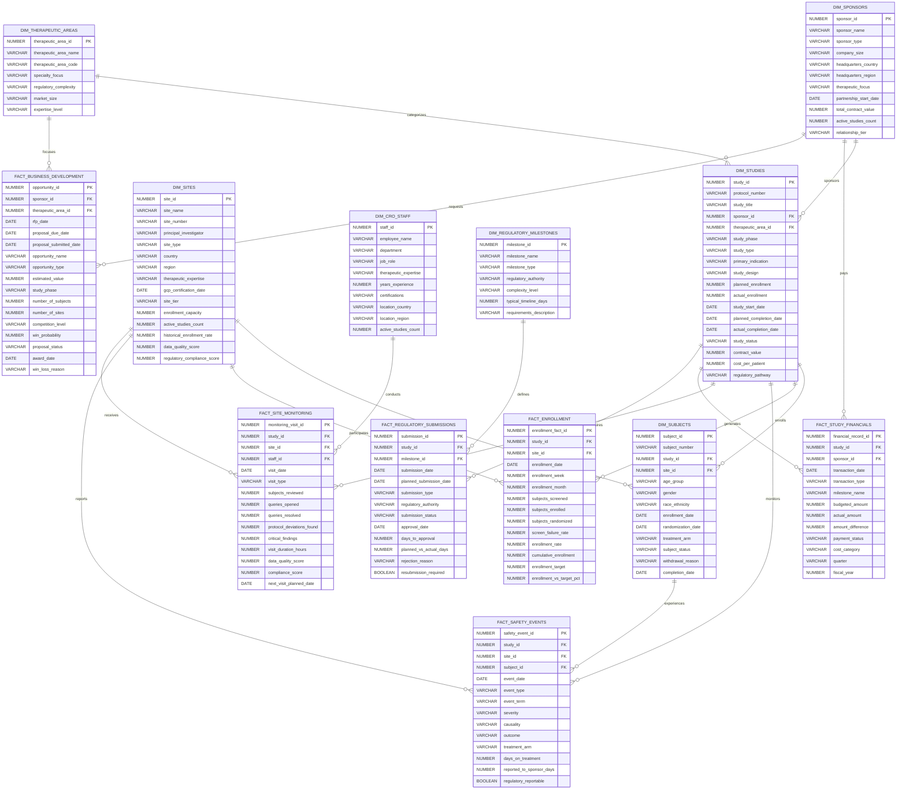
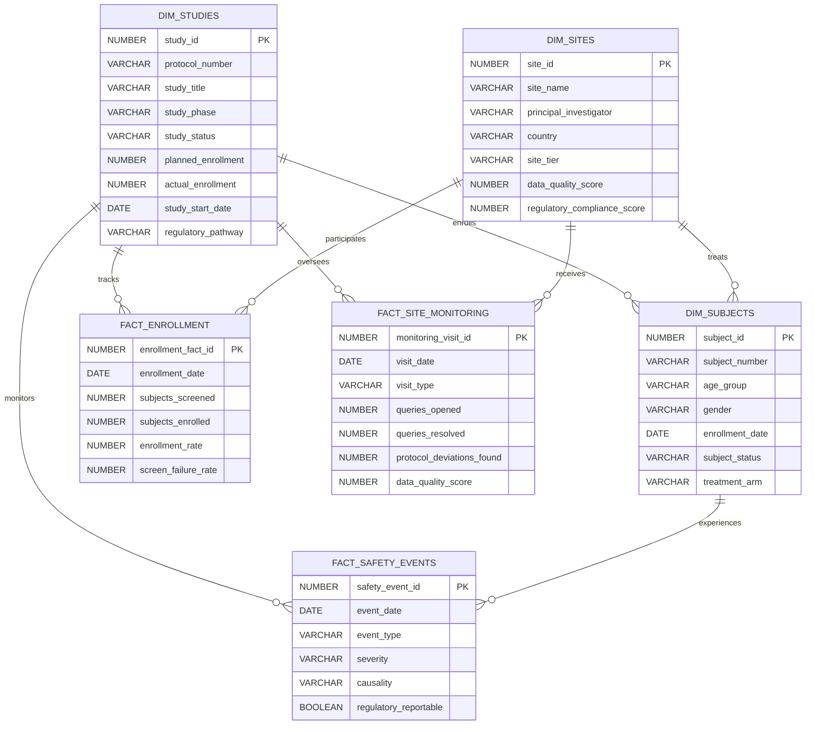
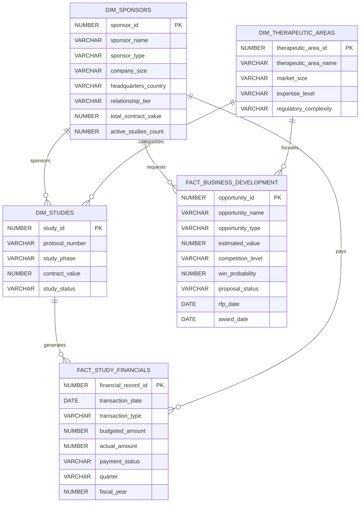
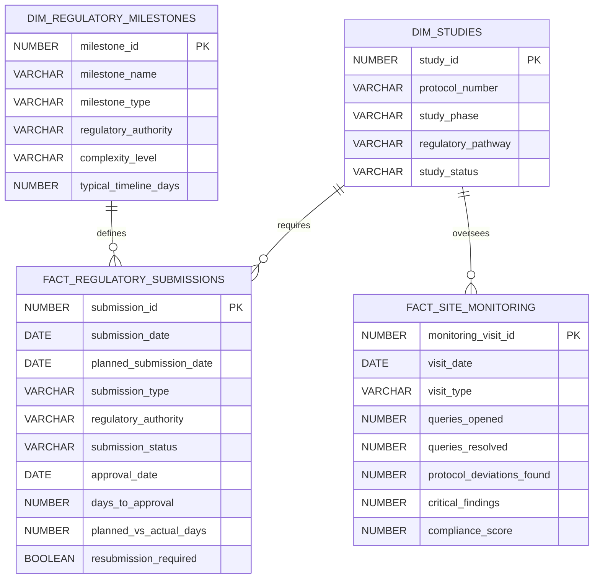

# CRO Data Model - Entity Relationship Diagrams

This document provides comprehensive Entity Relationship Diagrams (ERDs) for the Contract Research Organization (CRO) data model, showing the relationships between clinical trial entities, sponsor management, regulatory tracking, and financial operations.

## Complete CRO Data Model Overview

## Clinical Operations Focus ERD

This diagram focuses on the core clinical trial operations entities and their relationships:

## Business Development & Sponsor Management ERD

This diagram shows the business development and sponsor relationship entities:

## Regulatory & Compliance ERD

This diagram focuses on regulatory submissions and compliance tracking:

## Data Model Key Features

### **Dimension Tables (Master Data)**
- **DIM_SPONSORS**: Biotech/pharma companies with relationship management
- **DIM_STUDIES**: Clinical trial protocols and study information
- **DIM_SITES**: Investigational sites and investigator network
- **DIM_SUBJECTS**: De-identified study participants
- **DIM_THERAPEUTIC_AREAS**: Disease areas and expertise levels
- **DIM_CRO_STAFF**: Clinical operations team members
- **DIM_REGULATORY_MILESTONES**: Submission types and requirements

### **Fact Tables (Transactional Data)**
- **FACT_ENROLLMENT**: Subject screening and enrollment tracking
- **FACT_SAFETY_EVENTS**: Adverse event and safety monitoring
- **FACT_SITE_MONITORING**: Site visits and data quality tracking
- **FACT_STUDY_FINANCIALS**: Contract values and payment tracking
- **FACT_REGULATORY_SUBMISSIONS**: Regulatory submission timelines
- **FACT_BUSINESS_DEVELOPMENT**: Proposal and opportunity tracking

### **Key Relationships**
1. **Study-Centric Model**: Studies are the central entity connecting sponsors, sites, subjects, and all activities
2. **Hierarchical Sponsor Management**: Sponsors → Studies → Sites → Subjects
3. **Comprehensive Tracking**: All activities (enrollment, safety, monitoring, financial) linked to studies
4. **Multi-Dimensional Analysis**: Support for analysis by therapeutic area, geography, time, and business metrics

### **Business Intelligence Capabilities**
- **Clinical Operations**: Study performance, enrollment, safety monitoring
- **Business Development**: Sponsor relationships, proposal analytics, win rates
- **Regulatory Affairs**: Submission tracking, compliance monitoring
- **Financial Management**: Contract performance, revenue recognition, budget tracking

This data model supports comprehensive CRO operations analytics while maintaining data integrity and enabling sophisticated business intelligence reporting through the semantic views.
